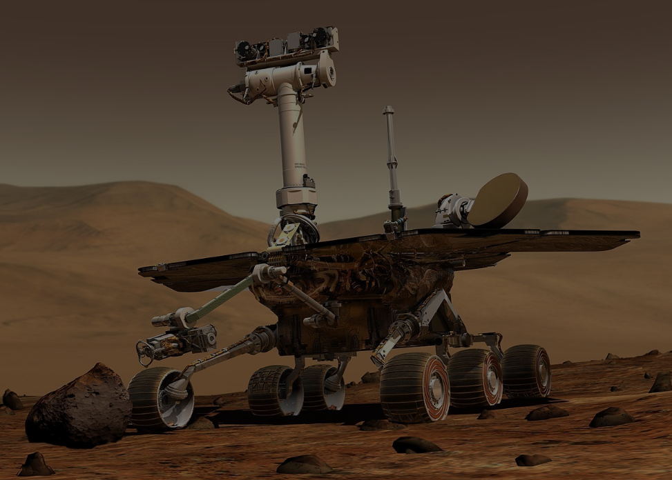
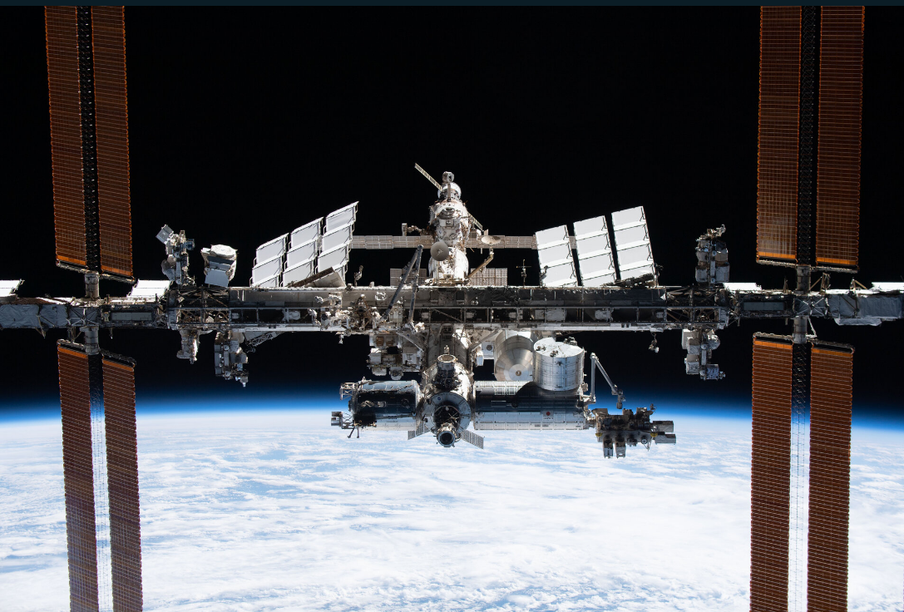

# CODSOFT-L1task2
Although I'm just a beginner in web development I've done my best to make this landing page's visual look more appeal and user-friendly. I've created a sample landing page for NASA's websites which includes information about NASA and some of its missions. 
Author- ATIYA Ali
# HTML CODE
<!DOCTYPE html>
<html lang="en">
<head>
    <meta charset="UTF-8">
    <meta name="viewport" content="width=device-width, initial-scale=1.0">
    <title>NASA Landing Page</title>
    <link rel="stylesheet" href="styles.css">
</head>
<body>
    <header>
        

            
            <h1>National Aeronautics & Space Administration</h1>
            <nav class="nav-links">
                <ul>
                    <li><a href="#about">About</a></li>
                    <li><a href="#missions">Missions</a></li>
                    <li><a href="#contact">Contact</a></li>
                </ul>
            </nav>
        

    </header>

    <section id="hero">
        

            <h2>Explore the Universe with NASA</h2>
            
Discover the latest discoveries, missions, and achievements.

        

    </section>

    <section id="about">
        

            <h2>About NASA</h2>
            
NASA, the National Aeronautics and Space Administration, is an independent agency of the 
                United States federal government responsible for the civilian space program, as well as 
                aeronautics and aerospace research.

        

    </section>

    <section id="missions">
        

            <h2>Mission Highlights</h2>
            

                <h3>Mars Rover Mission</h3>
                
Explore the surface of Mars with NASA's Mars Rover missions.  The Perseverance rover is
                    designed to study the rock record to   reveal more about the geologic processes that 
                    created and   modified the Martian crust and surface through time. Each layer   of rock
                    on the Martian surface contains a record of the   environment in which it was formed.

            

            
            

                <h3> International Space Station (ISS)</h3>
                
Learn about the ongoing research and discoveries on the ISS.   The International Space Station, 
                    or ISS, is an orbital laboratory   and has hosted more than 250 people since 1998. The  
                    International Space Station (ISS) is a multi-nation construction   project that is the largest 
                    single structure humans ever put into space. 

            

            
        

    </section>

    <section id="contact">
        

            <h2>Contact</h2>
            
For inquiries or more information, contact us at:

            
Email: 123@abc.xyz

            
Phone: 000-000-000/p>
        

    </section>

    <footer>
        

            
&copy; Created by Atiya Ali. All rights reserved.

        

    </footer>
</body>
</html>

# CSS CODE
* {
    margin: 0;
    padding: 0;
    box-sizing: border-box;
}

body {
    font-family: sans-serif, sans-serif;
    line-height: 1.6;
}

.logo {
    position: absolute;
    top: 20px;
    left: 20px;
    width: 100px; 
    height: auto; 
    z-index: 1; 
}

header h1 {
    position: relative;
    z-index: 2; 
    margin-left: 120px; 
}

.container {
    width: 80%;
    margin: auto;
}

header {
    display: flex;
    justify-content: space-between;
    align-items: center;
    background-color: #0B3D91;
    color: #fff;
    padding: 20px 40px; 
}

nav ul {
    list-style-type: none;
}

nav ul li {
    display: inline;
    margin-right: 20px;
}

nav ul li:last-child {
    margin-right: 0;
}

nav ul li a {
    color: #fff;
    text-decoration: none;
}

nav ul li a:hover {
    text-decoration: underline;
}

#hero {
    background-image: url('background.png');
    background-size: cover;
    height: 800px;
    display: flex;
    justify-content: center;
    align-items: center;
    color: #fff;
    text-align: center;
}
#about {
    background-image: url('background1.png');
    background-size: cover;
    height: 800px;
    color: #fff;
    
}
#missions {
    background-image: url('background2.png');
    background-size: cover;
    height: 900px;
    display: flex;
    justify-content: center;
    align-items: center;
    color: white;
    text-align: left;
    padding: 0;
    margin: 0;
}
#contact {
    background-image: url('last.png');
    background-size: cover;
    height: 700px;
    display: flex;
    justify-content: center;
    align-items: center;
    color: white;
    text-align: left;
    padding: 0;
    margin: 0;
}

#missions .mars-image {
    background-image: url('mars.jpg'); 
    background-size: contain; 
    background-position: center; 
    width: 50%; 
    height: auto; 
}

#about, #missions, #contact {
    padding: 50px 0;
}

footer {
    background-color: #0B3D91;
    color: #fff;
    text-align: center;
    padding: 20px 0;
}
